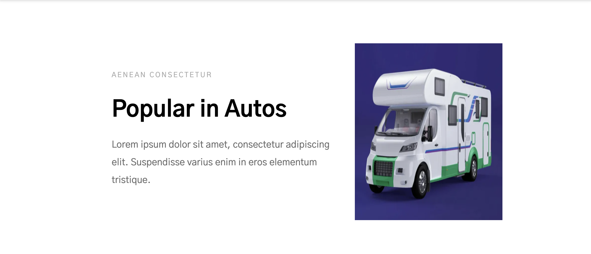
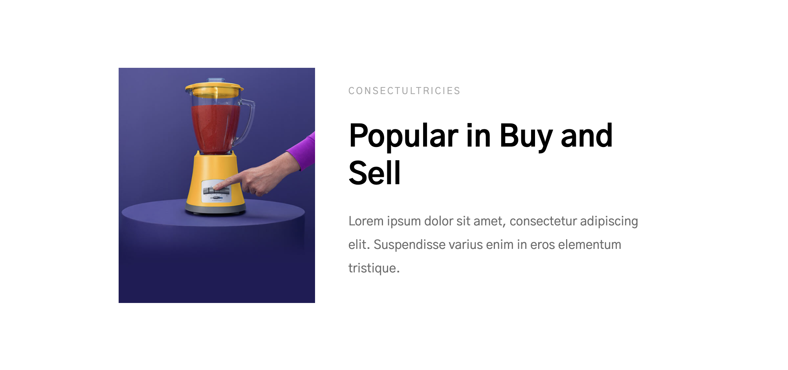
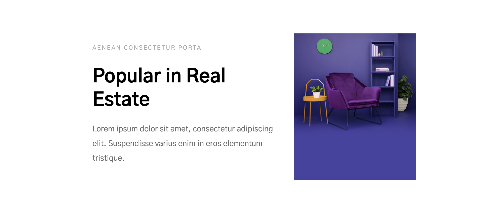
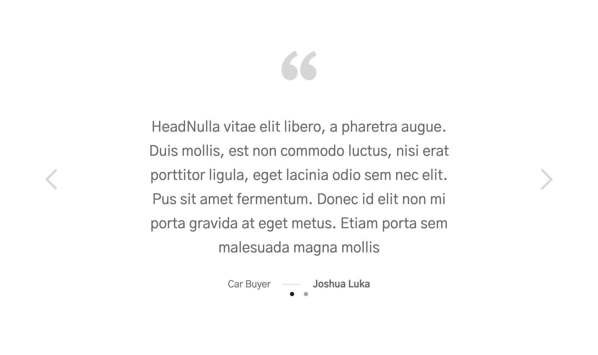
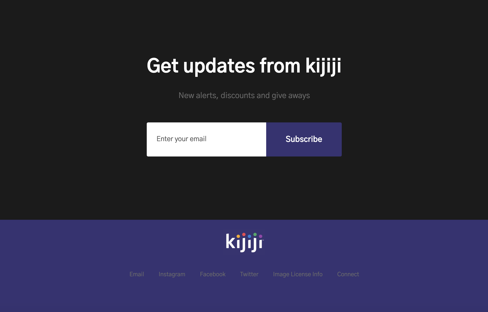
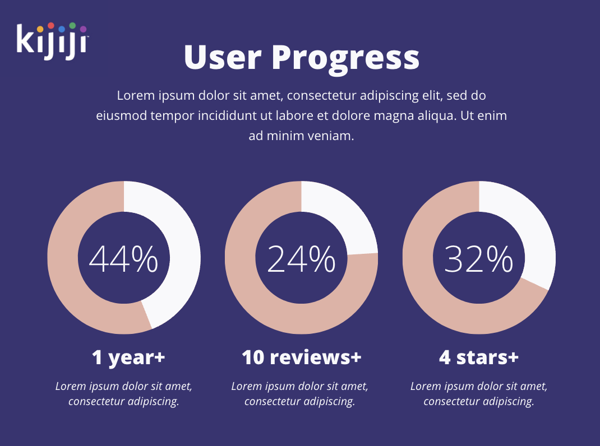

## Things that work

1. Original and classic, everyone's go to site

2. Trustworthy and good reputation

## Things to improve

- Design and aesthetics of a website can influence how people perceive and trust a business or organization.
  - modern
  - clean
  - easy to navigate

### Mock-ups

### 1. Sign up: survey

- Customize user preferecences
  

### 2. Gamification

#### i. Super Seller

- Perks: build trust among users, likely to have transactions, upward spiral!
- Requirement to become superseller:
  1 year membership
  4 stars on avg
  minimum 10 reviews
- Redirect to homepage and name has a :fire: icon beside to show you're a superseller!

#### ii. Earn Rewards

- Coconut Badges:
- Teepee Perks:
- Simba Discounts: $, %

### 3. Review Feature

- Seller can only view the buyer's review once they've submitted review on the buyer, and vice versa.
- Encourage reviews and create engagement and more interaction among users
- More reviews = more trust

